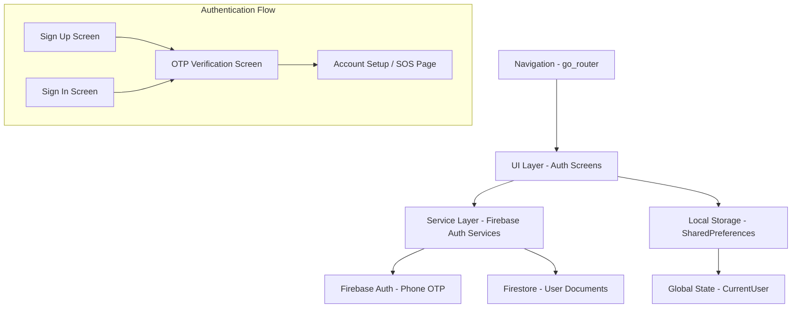
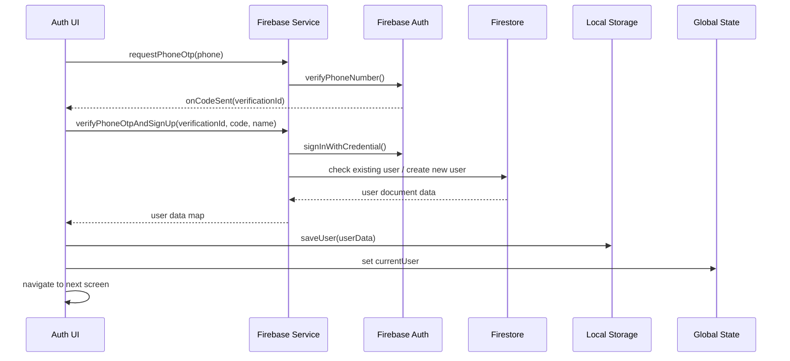

# Design Document

## Overview

The phone authentication system will be built as a comprehensive replacement for the current email-based authentication flow. The system leverages Firebase Phone Authentication with OTP verification, Firestore for user data persistence, SharedPreferences for local storage, and go_router for navigation state management. The design follows a modular architecture separating UI components, Firebase services, local storage utilities, and navigation logic.

The system supports both new user sign-up and existing user sign-in flows, with proper error handling, loading states, and user experience considerations. All components will follow the existing app design system using AppTheme, AppColors, AppTypography, and SizeConfig for consistent styling.

## Architecture

### High-Level Architecture



### Data Flow Architecture



## Components and Interfaces

### 1. Firebase Authentication Service (`firebase_auth_services.dart`)

**Core Interface:**
```dart
class PhoneAuthService {
  // Request OTP for phone number
  Future<void> requestPhoneOtp({
    required String phone,
    required Function(String verificationId) onCodeSent,
    required Function(String error) onError
  });

  // Verify OTP and complete sign-up
  Future<Map<String, dynamic>?> verifyPhoneOtpAndSignUp({
    required String verificationId,
    required String smsCode,
    required String name,
    String? profilePhotoUrl,
    List<Map<String, String>>? emergencyContacts
  });

  // Sign in existing user with OTP
  Future<Map<String, dynamic>?> signInWithPhoneOtp({
    required String verificationId,
    required String smsCode
  });

  // Sign out and cleanup
  Future<void> signOut();
}
```

**Key Responsibilities:**
- Handle Firebase Phone Auth OTP flow
- Manage Firestore user document creation and retrieval
- Ensure phone number uniqueness
- Return standardized user data maps
- Provide clear error handling and messaging

### 2. Authentication UI Service (`auth_services.dart`)

**Components:**
- `PhoneSignUpScreen`: Collects name and phone number
- `OTPVerificationScreen`: Handles OTP input and verification
- `PhoneSignInScreen`: Existing user phone sign-in
- `AuthScreen`: Main authentication coordinator

**Key Features:**
- Form validation using existing patterns
- IntlPhoneField for international phone numbers
- Loading states and error handling
- Navigation integration with go_router
- Consistent styling with AppTheme

### 3. Local Storage Service (`local_user_store.dart`)

**Interface:**
```dart
class LocalUserStore {
  static Future<void> saveUser(Map<String, dynamic> userData);
  static Future<Map<String, dynamic>?> getUser();
  static Future<void> clearUser();
  static Future<bool> hasStoredUser();
}
```

**Storage Format:**
```json
{
  "uid": "firebase_uid",
  "name": "User Name",
  "profilePhotoUrl": "https://...",
  "emergencyContacts": [...],
  "phoneNumber": "+1234567890",
  "createdAt": "2025-01-15T10:30:00Z"
}
```

### 4. Navigation and Routing

**Route Structure:**
```dart
GoRouter(
  routes: [
    GoRoute(path: '/', builder: (context, state) => AuthLandingScreen()),
    GoRoute(path: '/auth/signUp', builder: (context, state) => PhoneSignUpScreen()),
    GoRoute(path: '/auth/signIn', builder: (context, state) => PhoneSignInScreen()),
    GoRoute(
      path: '/auth/verifyOtp',
      builder: (context, state) {
        final extra = state.extra as Map<String, dynamic>;
        return OTPVerificationScreen(
          verificationId: extra['verificationId'],
          name: extra['name'],
          phone: extra['phone'],
          isSignUp: extra['isSignUp'] ?? true,
        );
      }
    ),
    GoRoute(path: '/accountSetup', builder: (context, state) => AccountSetupScreen()),
    GoRoute(path: '/sosPage', builder: (context, state) => SOSPage()),
  ]
)
```

## Data Models

### User Document Schema (Firestore)

```dart
{
  'uid': String,                    // Firebase Auth UID
  'name': String,                   // User's display name
  'profilePhotoUrl': String?,       // Nullable profile photo URL
  'emergencyContacts': List<Map>?,  // Nullable emergency contacts array
  'phoneNumber': String,            // Verified phone number
  'createdAt': Timestamp,           // Server timestamp
}
```

### Emergency Contact Schema

```dart
{
  'name': String,
  'phone': String,
  'relationship': String?,
}
```

### Local Storage User Model

```dart
class StoredUser {
  final String uid;
  final String name;
  final String? profilePhotoUrl;
  final List<Map<String, String>>? emergencyContacts;
  final String phoneNumber;
  final DateTime createdAt;

  Map<String, dynamic> toJson();
  factory StoredUser.fromJson(Map<String, dynamic> json);
}
```

## Error Handling

### Error Categories and Responses

1. **Phone Number Validation Errors**
   - Invalid format: "Please enter a valid phone number"
   - Missing country code: "Please select your country"

2. **OTP Request Errors**
   - Network failure: "Unable to send OTP. Please check your connection"
   - Invalid phone: "This phone number is not valid"
   - Rate limiting: "Too many attempts. Please try again later"

3. **OTP Verification Errors**
   - Invalid code: "Invalid verification code. Please try again"
   - Expired code: "Verification code expired. Please request a new one"
   - Network error: "Verification failed. Please check your connection"

4. **Firestore Errors**
   - Permission denied: "Unable to create account. Please try again"
   - Network error: "Connection error. Please check your internet"
   - Document creation failure: "Account creation failed. Please try again"

5. **Local Storage Errors**
   - Storage failure: "Unable to save login information"
   - Retrieval failure: "Unable to load saved login"

### Error Recovery Strategies

- **Retry mechanisms**: Automatic retry for network failures
- **Fallback options**: Alternative flows when primary methods fail
- **User guidance**: Clear instructions for resolving issues
- **Graceful degradation**: Continue with limited functionality when possible

## Testing Strategy

### Unit Tests

1. **Firebase Service Tests**
   - Mock Firebase Auth responses
   - Test OTP request and verification flows
   - Validate user document creation logic
   - Test phone uniqueness checking

2. **Local Storage Tests**
   - Test user data serialization/deserialization
   - Validate storage and retrieval operations
   - Test error handling for storage failures

3. **Validation Tests**
   - Phone number format validation
   - Name input validation
   - OTP code format validation

### Integration Tests

1. **Authentication Flow Tests**
   - Complete sign-up flow from phone entry to account creation
   - Sign-in flow for existing users
   - Navigation between screens
   - Error handling across the flow

2. **Data Persistence Tests**
   - Firestore document creation and retrieval
   - Local storage persistence across app restarts
   - Data synchronization between local and cloud storage

### Widget Tests

1. **UI Component Tests**
   - Phone input field validation and formatting
   - OTP input field behavior
   - Loading states and error displays
   - Navigation button functionality

2. **Form Validation Tests**
   - Real-time validation feedback
   - Submit button enable/disable logic
   - Error message display

### End-to-End Tests

1. **Complete User Journeys**
   - New user sign-up with phone verification
   - Existing user sign-in
   - App restart with stored user data
   - Sign-out and cleanup

## Security Considerations

### Phone Number Security
- Server-side validation of phone numbers
- Rate limiting for OTP requests
- Secure storage of phone numbers in Firestore

### OTP Security
- Time-limited verification codes
- Single-use OTP validation
- Secure transmission of verification data

### Data Protection
- Encrypted local storage for sensitive data
- Secure Firestore rules for user documents
- Proper cleanup of authentication tokens

### Firestore Security Rules

```javascript
rules_version = '2';
service cloud.firestore {
  match /databases/{database}/documents {
    match /users/{userId} {
      allow read, write: if request.auth != null && request.auth.uid == userId;
      allow create: if request.auth != null && 
                   request.auth.uid == resource.data.uid &&
                   validateUserData(request.resource.data);
    }
  }
}

function validateUserData(data) {
  return data.keys().hasAll(['uid', 'name', 'phoneNumber', 'createdAt']) &&
         data.uid is string &&
         data.name is string &&
         data.phoneNumber is string;
}
```

## Performance Considerations

### Optimization Strategies

1. **Lazy Loading**: Load user data only when needed
2. **Caching**: Cache user data locally to reduce Firestore reads
3. **Batch Operations**: Group related Firestore operations
4. **Connection Handling**: Graceful handling of network connectivity issues

### Resource Management

1. **Memory Usage**: Efficient handling of user data objects
2. **Network Usage**: Minimize unnecessary API calls
3. **Storage Usage**: Optimize local storage data structure
4. **Battery Usage**: Efficient background processing

## Migration Strategy

### From Current System

1. **Gradual Migration**: Support both email and phone auth during transition
2. **Data Migration**: Convert existing users to new data structure
3. **Backward Compatibility**: Maintain existing user sessions
4. **Feature Flags**: Control rollout of new authentication system

### Implementation Phases

1. **Phase 1**: Implement core phone auth services
2. **Phase 2**: Create new UI components and navigation
3. **Phase 3**: Integrate local storage and data persistence
4. **Phase 4**: Update routing and global state management
5. **Phase 5**: Testing and validation
6. **Phase 6**: Gradual rollout and monitoring